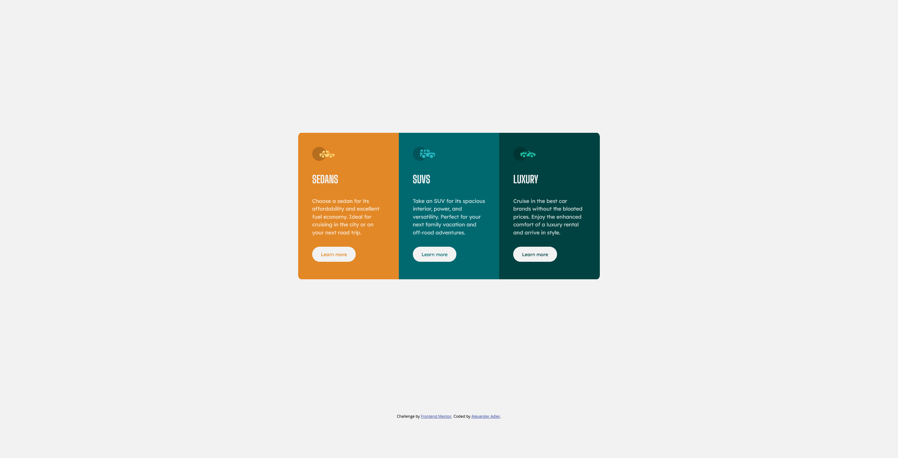

# Frontend Mentor - 3-column preview card component solution

This is a solution to the [3-column preview card component challenge on Frontend Mentor](https://www.frontendmentor.io/challenges/3column-preview-card-component-pH92eAR2-). Frontend Mentor challenges help you improve your coding skills by building realistic projects. 

## Table of contents

- [Overview](#overview)
  - [The challenge](#the-challenge)
  - [Screenshot](#screenshot)
  - [Links](#links)
- [My process](#my-process)
  - [Built with](#built-with)
  - [What I learned](#what-i-learned)
  - [Useful resources](#useful-resources)
- [Author](#author)

## Overview

### The challenge

Users should be able to:

- View the optimal layout depending on their device's screen size
- See hover states for interactive elements

### Screenshot

### Links

- Solution URL: [https://github.com/aadler91/frontendmentor_3-column-preview-card](https://github.com/aadler91/frontendmentor_3-column-preview-card)
- Live Site URL: [Add live site URL here](https://your-live-site-url.com)

## My process

### Built with

- Semantic HTML5 markup
- CSS custom properties
- Flexbox
- CSS Grid
- Mobile-first workflow

### What I learned

- use a wrapper for the body to center the content
- use BEM methodology to structure css an classes and to make code reusable für other projects

### Useful resources

- [CSS Grid](https://css-tricks.com/snippets/css/complete-guide-grid/)

## Author

- GitHub - [Add your name here](https://github.com/aadler91)
- Frontend Mentor - [@aadler91](https://www.frontendmentor.io/profile/aadler91)

